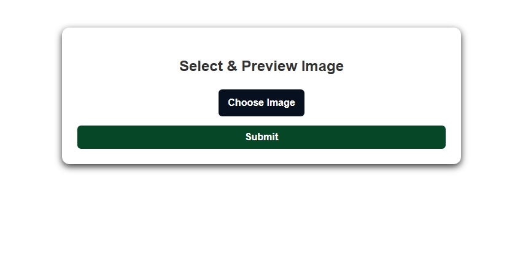
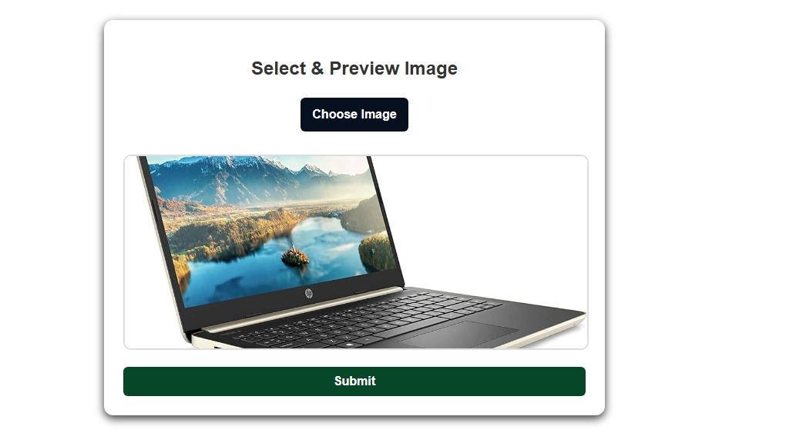

# 📁 React Image Upload & Preview Component

This project is a simple and clean **React Image Upload & Preview Component**. It allows users to choose an image from their device, instantly preview it, and submit it. The UI is modern, centered, and styled with smooth animations.

---

## 🚀 Features

* Upload images from device
* Live image preview
* Clean, modern UI
* Smooth transitions & animations
* Fully responsive design
* Simple and easy-to-understand code

---

## 📂 Project Structure

```
/my-app
|----screenshot
        |--my-app/screenshot/Screenshot_5-12-2025_1623_localhost.jpeg 
        |--my-app/screenshot/Screenshot_5-12-2025_16224_localhost.jpeg
        |-- my-app/screenshot/Screenshot (697).png
src/
├── Fileupload.jsx
└── fileupload.css
|README.md
```

---
## screenshot overview

1.homepage


2.select image


3.file upload successfully msg
.png>)


### 4️⃣ Start the project

```bash
cd my-app
npm run dev
```

---

## 🖼 Component Preview

When the user selects an image, a preview box appears with the uploaded picture.

---

---

## 📝 How It Works

1. User clicks **Choose Image**
2. Selects any image file
3. JavaScript creates a temporary URL using `URL.createObjectURL()`
4. Image preview appears instantly
5. Clicking **Submit** shows success confirmation

---

## 📌 Notes

* Works with all image formats: JPG, PNG, WebP, GIF, SVG
* No backend required
* 100% client-side functionality

